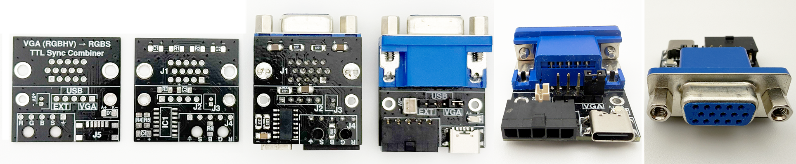
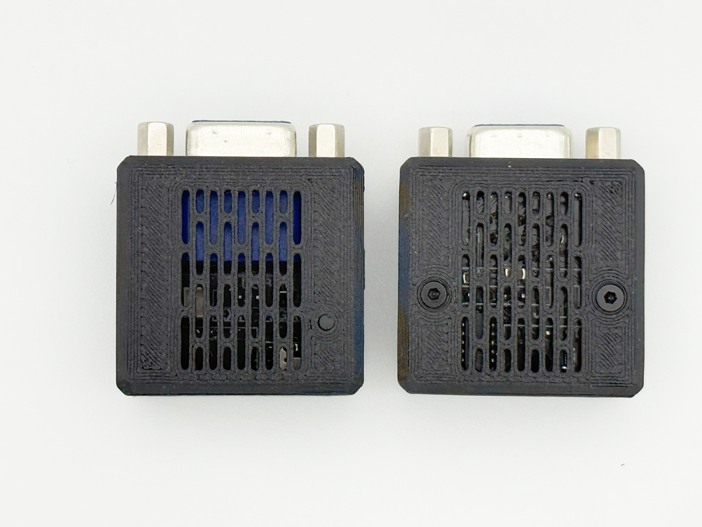
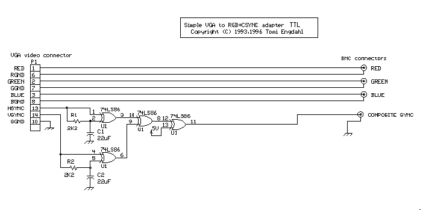

# VGA RGBHV to RGBS / C-Sync Combiner for Audi RNS-E

This project contains a small KiCad PCB for converting a VGA-style RGBHV signal into an RGBS signal suitable for the RGB video input of an Audi RNS-E navigation unit.

The board was designed for use with HDMI-to-VGA adapters or similar VGA/RGBHV sources. It passes the red, green and blue video signals through and combines the separate horizontal and vertical sync signals into one composite sync signal.

The circuit is based on the VGA to RGB+CSYNC adapter by Tomi Engdahl. The PCB is not a direct 1:1 copy of the original TTL output circuit. It adapts the basic 74HCT86 sync-combiner concept for this specific RNS-E use case, including a series resistor on the C-Sync output and practical connector/power options.

## Purpose

The Audi RNS-E RGB input expects RGBS video, while common VGA sources output RGBHV. This board converts the sync part from RGBHV to RGBS by combining H-Sync and V-Sync into one C-Sync signal. The RGB video lines are routed directly through the PCB.

## PCB

The PCB is designed to be hand-solder friendly. It uses larger SMD packages where practical, mainly 1206 passives and an SOIC-14 logic IC. The layout is intended for manual assembly rather than automated production.

Power for the logic IC can be selected by jumper:

| Jumper source    | Description           |
| ---------------- | --------------------- |
| VGA +5V          | Via VGA Pin 9         |
| USB-C +5V        | Via USB-C connector   |
| External JST +5V | Via external 5V input |

**Only one jumper position and one 5V power source must be used at a time. Do not connect multiple 5V sources simultaneously.**

The external JST input is intended as an optional 5V supply. Its polarity is marked directly on the PCB. Check polarity before applying power.

<p align="center">
  
</p>


## Audi RNS-E Connection

The board was made for an Audi RNS-E RGBS input setup. The RGB and C-Sync output can be wired to the corresponding RNS-E AV/RGB connector pins.

The exact pinout depends on the connector and wiring harness used. Check the pinout of your RNS-E unit before connecting the board. Incorrect wiring, especially on the 5V supply or sync line, can damage connected hardware.

## Case

A matching 3D-printable case is included. The case is intended to protect the PCB and make the adapter easier to install in a vehicle or cable harness.

<p align="center">
  
</p>

The case files are located in:

```text
3d_print_case/
├─ vga_sync_combiner.3mf
├─ vga_sync_combiner.stl
└─ 3d_models/
   ├─ vga_sync_combiner_case.step
   └─ vga_sync_combiner_with_all_pcb_parts.step
```

## Repository Structure

```text
/
├─ 3d_print_case/
│  ├─ 3d_models/
│  ├─ vga_sync_combiner.3mf
│  └─ vga_sync_combiner.stl
├─ docs/
│  └─ images/
├─ kicad_files/
│  ├─ 3dmodels/
│  ├─ gerber_to_order/
│  ├─ vga_sync_combiner_footprints.pretty/
│  ├─ vga_sync_combiner_symbols.kicad_sym
│  ├─ vga_sync_combiner_usb-c.csv
│  ├─ vga_sync_combiner_usb-c.kicad_pro
│  ├─ vga_sync_combiner_usb-c.kicad_sch
│  └─ vga_sync_combiner_usb-c.kicad_pcb
└─ README.md
```

## Production Files

The `kicad_files/gerber_to_order/` folder contains Gerber ZIP exports for ordering bare PCBs.

Available exports:

```text
kicad_files/gerber_to_order/vga_sync_combiner_usb-c_31.0x31.0mm_for_Default.zip
kicad_files/gerber_to_order/vga_sync_combiner_usb-c_31.0x31.0mm_for_Elecrow.zip
kicad_files/gerber_to_order/vga_sync_combiner_usb-c_31.0x31.0mm_for_FusionPCB.zip
kicad_files/gerber_to_order/vga_sync_combiner_usb-c_31.0x31.0mm_for_JLCPCB.zip
kicad_files/gerber_to_order/vga_sync_combiner_usb-c_31.0x31.0mm_for_PCBWay.zip
```

The BOM is located at:

```text
kicad_files/vga_sync_combiner_usb-c.csv
```

The BOM also includes parts that are not mounted directly on the PCB, such as cables, crimp contacts, connector housings and jumper/shunt parts. It is therefore intended as a complete project BOM, not necessarily as a direct assembly BOM for PCB assembly services.

## Notes

This board is intended for experimental/custom RNS-E video input builds. It is not an official Audi product and has no relation to Audi.

The original Engdahl circuit is a TTL-level sync combiner. This PCB keeps the 74HCT86-based sync-combiner principle, but the output stage is adapted for this project. Depending on the target device, video source and wiring, the C-Sync output resistor may need adjustment.


## Credits

The sync-combining logic is based on the original VGA to RGB+CSYNC adapter circuit by Tomi Engdahl, 1993-1996.
The included PCB adapts the concept for an Audi RNS-E RGBS input use case.

<p align="center">
  
</p>
